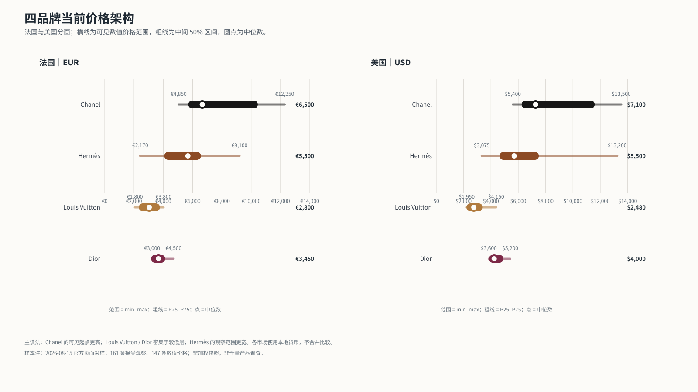
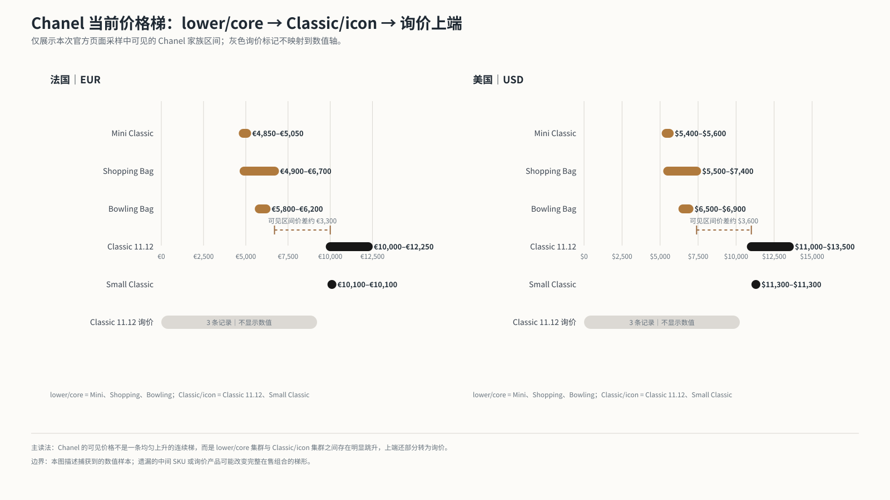
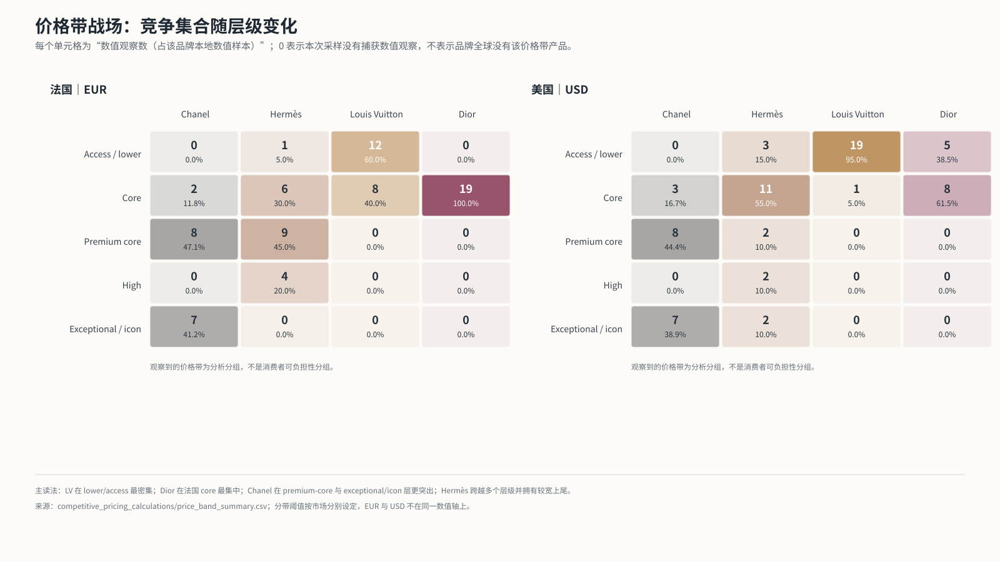
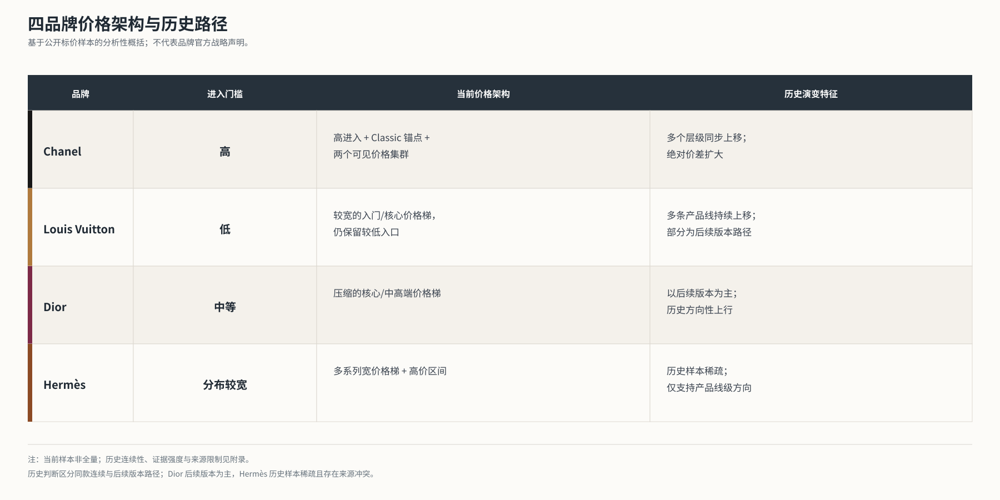
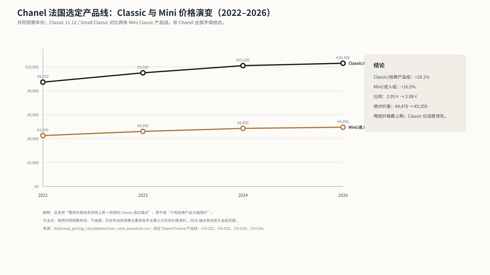
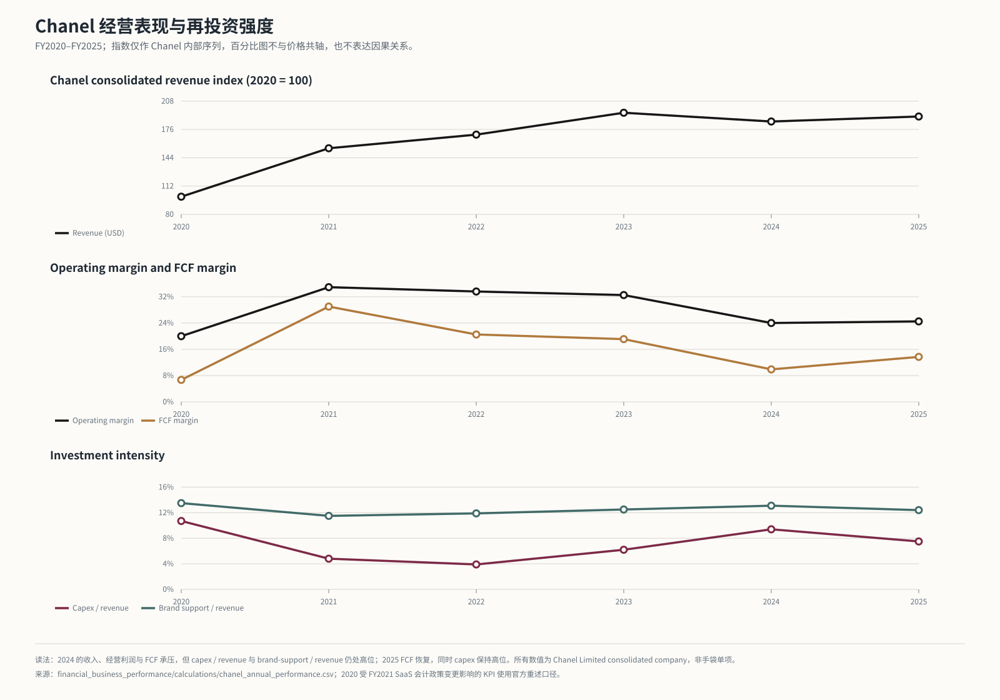
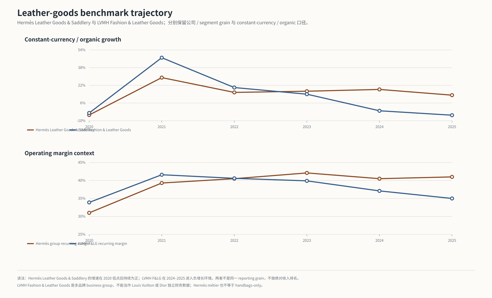
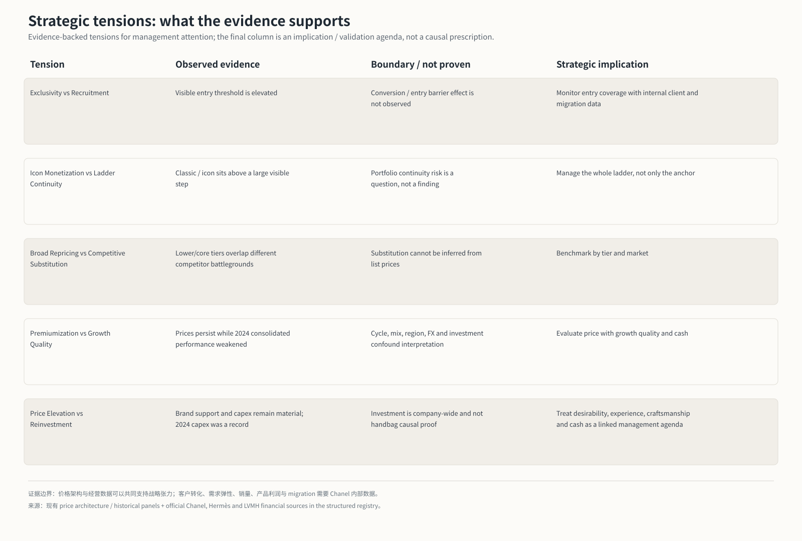

# Chanel Premiumization Strategy

## 手袋价格架构、经营表现与竞争定位

**研究问题：**Chanel 如何构建并持续抬升其手袋价格架构？这种 premiumization 在多大程度上伴随着健康的增长、盈利能力与品牌经济性，其表现与 Hermès 及更广泛的奢侈品皮具市场相比如何？

**价格窗口：**2020–2026｜**当前价格快照：**2026-08-15｜**Financial core window：**FY2020–FY2025

## 1. Executive thesis

### 结论先行

Chanel 的 premiumization 是整套价格架构上移，不只是提高 Classic 的标价：

- 当前样本中，Chanel 具有较高的可见 entry/core 起点、集中的 premium 区域和明确的 Classic/icon 高位锚点；
- 2022–2026 对齐的法国选定产品线显示，Mini/access-core 与 Classic/icon 都上移，Classic 的高位关系保持，绝对价差扩大；
- 在同一时期，Chanel consolidated company 的收入复苏、经营利润率、现金创造和品牌 / 资本投入与 premiumization 共存；
- 但 2024 年收入、经营利润和 FCF 同时承压，2025 年部分恢复。这说明价格上移不能被当作已验证的增长引擎，也不能消除行业周期、地域需求或再投资要求。

更稳健的判断是：**Chanel 的 premiumization quality 取决于价格梯、Classic 锚点、品牌 desirability、分销 / client experience、craftsmanship / supply 和现金 / 利润表现能否共同维持。公开资料支持这些因素共存，也暴露出它们之间的张力，但不支持价格对经营结果的因果结论。**

## 2. How Chanel’s handbag price architecture works

当前接受观察为 41 条，其中 35 条有 numeric price；法国 20 条中 17 条有数值，美国 21 条中 18 条有数值。以下是按既有市场价格带折叠后的四层诊断：

| Analytical tier | France / EUR | United States / USD | Chanel observed role |
|---|---:|---:|---|
| Entry / lower | < €3,000 | < $4,000 | 本次 Chanel snapshot 没有 numeric observation |
| Core | €3,000–€4,999 | $4,000–$5,999 | Mini Classic 的低端与部分 Shopping Bag |
| Premium | €5,000–€9,999 | $6,000–$10,999 | Shopping / Bowling 与较高的 brand-internal core |
| Icon / exceptional | ≥ €10,000 | ≥ $11,000 | Classic 11.12、Small Classic 及高价变体 |

Chanel 本次可见的 numeric range 为法国 €4,850–€12,250、美国 $5,400–$13,500。当前样本中：

- 法国最大 pre-icon → icon 可见间隔为 €6,700 → €10,000，即 €3,300；
- 美国最大 pre-icon → icon 可见间隔为 $7,400 → $11,000，即 $3,600；
- 产品家族 median 的最大 step 为 Bowling Bag → Small Classic：法国 €4,100，美国 $4,600；
- numeric / non-numeric visibility 为 35 / 6。6 条 Chanel non-numeric rows 为 `contact_us` 且没有数值价格，作为 visibility state 保留，不被插值成更高价格。

*图 1。四品牌当前数值价格的本地货币范围与中间 50% 区间；各市场分别计算。*

*图 2。Chanel 价格梯度基于观察到的 numeric list prices；可见间隔不等同于完整 assortment 的产品缺口，也不等同于需求 barrier。*

Chanel 的差异不在于“所有产品都在最高价”，而在于：品牌内部仍有 Mini / Shopping / Bowling 等入口与核心家族，但可见 numeric ladder 没有从这些层级连续铺到 Classic 高位锚点。这里的“entry threshold”是公开样本中的观察价格位置，不是消费者可负担性测量。

### 竞争按 tier 发生

四品牌当前接受观察为 161 条，其中 147 条有 numeric price。价格带显示：较低区间更靠近 Louis Vuitton 和 Dior；Chanel 与 Hermès 的重叠主要出现在较高价格区间；但品牌之间不能用一个全局“谁更贵”顺序代表。

*图 3。0 表示本次采样没有捕获 numeric observation，不代表品牌全球没有相应产品。*

法国方向性可比单元也支持这种分层读法：在 `tote | large | leather` 单元，Chanel median 为 €6,200，Hermès 为 €6,475，Dior 为 €3,350；在 `tote | standard | leather` 单元，Chanel 为 €5,700，Dior 为 €3,400，Louis Vuitton 为 €2,900。部分单元品牌 N 仅为 1–2，因而只用于定位，不代表严格同款替代或消费者选择份额。

*图 4。矩阵是基于公开标价样本的分析性概括，不是品牌官方战略声明。*

## 3. How the architecture has changed

重跑历史面板后，Chanel France 的四条 selected continuous line 在共同年份 2022、2023、2024、2026 给出以下结果：

| FY / observed year | Classic / icon median | Mini / access-core median | Relative ratio | Absolute gap |
|---:|---:|---:|---:|---:|
| 2022 | €8,720 | €4,250 | 2.052× | €4,470 |
| 2023 | €9,500 | €4,600 | 2.065× | €4,900 |
| 2024 | €10,100 | €4,850 | 2.082× | €5,250 |
| 2026 | €10,300 | €4,950 | 2.081× | €5,350 |

2022–2026，Classic median 上涨 18.1%，Mini/access-core median 上涨 16.5%；ratio 变化有限，但 absolute gap 增加 €880。数据更支持这样的表述：**multiple tiers broad repricing，同时随着价格基数上升出现一定 ladder stretching；不是只有 Classic 在涨价。**

*图 5。只使用共同观察年份；不是 Chanel 全部手袋组合，也不是美国历史价格。*

方形 Mini 的 2020–2026 长窗口累计上涨约 44.8%，但它与 Classic 的主要比较采用 2022–2026 对齐窗口，避免起点不同造成误读。历史 panel 一共 77 条接受观察、76 条 numeric、13 条 lineages，其中 7 条 same-model continuous、6 条 successor；缺失年份没有被当成零变化。

## 4. What happened to the business while this occurred

### Chanel consolidated company

以下为 Chanel Limited consolidated company figures；金额为 USD millions。2020 的 operating profit 与 capex 使用 FY2021 release 提供的 restated comparative，原始 FY2020 数值仍在 financial panel 作为 `comparative_only` 保存。

| FY | Revenue | Comparable growth | Operating profit | Operating margin* | FCF | Capex / revenue | Brand-support / revenue |
|---:|---:|---:|---:|---:|---:|---:|---:|
| 2020 | 10,108 | -18.0% | 2,018 | 20.0% | 679 | 10.7% | 13.5% |
| 2021 | 15,639 | +49.6% | 5,461 | 34.9% | 4,540 | 4.8% | 11.5% |
| 2022 | 17,200 | +17.0% | 5,776 | 33.6% | 3,534 | 3.9% | 11.9% |
| 2023 | 19,700 | +16.0% | 6,407 | 32.5% | 3,755 | 6.2% | 12.5% |
| 2024 | 18,699 | -4.3% | 4,479 | 24.0% | 1,842 | 9.4% | 13.1% |
| 2025 | 19,269 | +1.8% comparable / +3.0% reported | 4,712 | 24.5% | 2,646 | 7.5% | 12.4% |

\* Operating margin 为 operating profit / revenue 的 derived ratio；2022、2023 revenue 为官方披露的 rounded $17.2bn / $19.7bn，因此相应 derived ratios 为近似值。

*图 6。Chanel consolidated company；价格与 financial performance 不在同一坐标轴，时间共变不是因果证据。*

经营轨迹可以分为四个阶段：

1. **2020 pandemic shock：**revenue、margin、FCF 明显收缩，但 capex intensity 仍高，说明公司没有把高端定位简化为只提高标价。
2. **2021–2023 rebound and expansion：**revenue 从 $15,639m 增至 $19,700m，operating margin 维持在 32.5%–34.9%，FCF 保持正值且较高。
3. **2024 deterioration with record investment：**comparable growth -4.3%，operating profit 下降 30.1%，FCF 下降 50.9%；同时 capex/revenue 升至 9.4%，brand-support/revenue 为 13.1%。
4. **2025 reported recovery with elevated investment：**reported revenue +3.0%、comparable growth +1.8%，operating profit +5.2%，FCF +43.6%；capex 与 brand-support investment 仍分别为 $1,449m 与 $2,395m。

2020–2025 的名义 revenue CAGR 为 13.8%，但不能将这项 CAGR 读作价格策略的因果回报。它同时包含疫情低基数、产品 / 地域 mix、行业环境、汇率、投资周期和 consolidated company perimeter 的影响。

### 再投资与 brand economics

Chanel 官方 FY2024–FY2025 commentary 继续披露 boutiques、client experience、real estate、craftsmanship、supplier expertise / capacity 等投入；FY2025 release 还披露超过 $700m 的 supplier / craftsmanship investment。放回价格架构看，这些投入共同构成了：

`Pricing ↕ Desirability ↕ Distribution / client experience ↕ Craftsmanship / supply ↕ Brand investment ↕ Cash generation / profitability`

这是一套解释框架，不是本项目已经验证的因果模型。公开数据只能证明 price elevation 与持续再投资共同存在，不能分解哪一项投入带来哪一项需求或利润结果。

## 5. Chanel 与竞品的差异

### Hermès：皮具业务 benchmark

Hermès Leather Goods & Saddlery 的规模和增长最接近本项目需要的皮具经济 benchmark，但其 métier 不等于 handbags-only。以下仍同时保留 group grain 和 segment grain：

| FY | Group revenue (€m) | Group recurring op margin | Leather Goods & Saddlery revenue (€m) | Leather segment constant-currency growth | Leather share of group |
|---:|---:|---:|---:|---:|---:|
| 2020 | 6,389.4 | 31.0% | 3,209.2 | -4.8% | 50.2% |
| 2021 | 8,982 | 39.3% | 4,091 | +29.0% | 45.5% |
| 2022 | 11,602 | 40.5% | 4,963 | +15.6% | 42.8% |
| 2023 | 13,427 | 42.1% | 5,547 | +16.7% | 41.3% |
| 2024 | 15,170 | 40.5% | 6,457 | +18.3% | 42.6% |
| 2025 | 16,002 | 41.0% | 7,070 | +13.1% | 44.2% |

Hermès 的 Leather Goods & Saddlery 2020–2025 revenue index 为 220.3（2020=100），Chanel consolidated revenue index 为 190.6；这两个 index 不能被读成“Hermès leather handbags 增长快于 Chanel handbags”，因为 entity、segment content、currency 和 category breadth 不同。Hermès 的 group margin context 更高且更稳定，能够支持 resilience comparison，但不是 Chanel handbag profitability 的可比替代。

### LVMH Fashion & Leather Goods：广泛行业环境

| FY | F&LG revenue (€m) | Reported growth | Organic growth | Recurring operating profit (€m) | Derived margin |
|---:|---:|---:|---:|---:|---:|
| 2020 | 21,207 | -5% | -3% | 7,188 | 33.9% |
| 2021 | 30,896 | +46% | +47% | 12,842 | 41.6% |
| 2022 | 38,648 | +25% | +20% | 15,709 | 40.6% |
| 2023 | 42,169 | +9% | +14% | 16,836 | 39.9% |
| 2024 | 41,060 | -3% | -1% | 15,230 | 37.1% |
| 2025 | 37,770 | -8% | -5% | 13,209 | 35.0% |

LVMH F&LG 2024–2025 的放缓与 Chanel 2024–2025 的 recovery 并不一致，因此 Chanel 的轨迹不能简单归因于一个统一的 industry cycle；但不同 company perimeter、currency、brand mix、FX 与 accounting presentation 也不允许把差异解释为 Chanel 的价格策略已经被证明优于 LVMH。

**重要 grain rule：**LVMH Fashion & Leather Goods 的 revenue / profit 只代表该 multi-brand business group，不能被写成 Louis Vuitton revenue、Dior revenue 或 Louis Vuitton + Dior revenue。Louis Vuitton 与 Dior 在本项目中仅作价格与官方 qualitative context。

*图 7。各系列在自己的 currency / reporting grain 内以 2020=100；不得跨币种比较 nominal size。*

## 6. 六个判断

### Q1 — Pricing evidence supports premiumization

**是，限定在 pricing evidence。** 当前架构显示较高 entry/core 起点和 Classic/icon 锚点；历史 aligned panel 显示 access/core 与 icon 都上移，absolute gap 扩大而 relative ratio 相对稳定。结论来自价格，不来自 revenue。

### Q2 — Premiumization 与经营表现共存，但不稳定

**整体上共存，但跨年份质量不均匀。** 2021–2023 revenue、margin、FCF 表现强；2024 明显恶化；2025 revenue、operating profit 和 FCF 恢复。更准确的表述是 `coexisted with recovery and continued investment`，不能把 pricing 与 growth 写成因果关系。

### Q3 — 价格架构保持，但不能证明需求韧性

**可以说 architecture 在不同周期中保持，但不能从价格证明 demand resilience。** 价格结构没有因为 2024 经营压力而在公开 snapshot 中下降，说明 architecture persistence；同时 2024 的 margin / FCF 压力说明业务仍暴露于周期与再投资要求。需求量、volume / mix、转化和客户迁移需要内部数据。

### Q4 — Chanel 与 Hermès 的差异

Chanel 的公开架构表现为较高可见起点 + Classic 锚点 + 较大的中间 gap；Hermès 当前 price ladder 更宽且上端更分散，经济 benchmark 则有 Leather Goods & Saddlery métier 与较高 group margin context。Hermès 不是“更贵”的简单答案，而是更适合做 leather-goods business momentum / margin context 的 benchmark。

### Q5 — Chanel 与 LVMH F&LG 环境的差异

LVMH F&LG 在 2020–2023 强劲、2024–2025 放缓；Chanel 2025 已报告 recovery。Chanel 的表现不能完全归因于行业周期，也不能被写成脱离行业周期；此处最稳健的结论是两者轨迹存在差异，但差异受 reporting grain、brand mix、FX 和 geographic exposure 影响。

### Q6 — Premiumization 伴随哪些投入？

Chanel financial releases 显示高水平 brand-support investment 和持续 capex，并辅以 boutiques、client experience、craftsmanship、supplier capacity、real estate 等官方 commentary。它支持“premiumization 伴随 reinvestment requirement”的解释；不支持把 brand-support investment 直接当作 handbag marketing expense，或证明 investment 导致 price / profit。

## 7. Strategic tensions

| Tension | Evidence-supported observation | What remains unproven / required internal data |
|---|---|---|
| Exclusivity vs recruitment | 高可见 entry threshold 与下层竞争重叠较少 | 是否降低 conversion、阻碍 recruitment，需要 customer funnel / migration data |
| Icon monetization vs ladder continuity | Classic 高位锚点强；pre-icon → icon gap €3,300 / $3,600 | gap 是否造成 portfolio migration risk，需要 assortment、conversion、client movement |
| Broad repricing vs competitive substitution | 多个层级均上移；不同 tier 对应 Dior / LV / Hermès 的竞争重叠不同 | 是否发生真实 substitution，需要 transaction、win/loss 或 client data |
| Premiumization vs growth quality | 2024 price architecture persistence 与 revenue / margin / FCF pressure 同时出现 | volume / mix、地区、投资、需求弹性不可由公开数据拆分 |
| Price elevation vs reinvestment requirement | brand-support、capex、craftsmanship / boutique / experience 投入持续存在 | 投入对 desirability、price realization 或 profit 的因果回报未识别 |

*图 8。张力矩阵用于战略问题定义；不是未经证实的“resilience score”。*

## 8. Strategic implications

1. **Manage the ladder, not only the Classic anchor.** Classic 的锚点清晰，但现有 evidence 也把中间可见 gap 变成需要监测的 architecture issue。缺少内部行为数据时，不应直接调整产品或价格。
2. **Monitor middle-ladder continuity.** 对 entry → core → icon 的 family step、numeric visibility 和 future assortment coverage 建立定期诊断；先确认 gap 是真实组合缺口还是公开样本缺失。
3. **Benchmark competitors by tier and grain.** 用 LV / Dior 观察 lower-core battleground，用 Hermès Leather Goods & Saddlery 看皮具业务 context，用 LVMH F&LG 看 broad multi-brand environment；不要使用单一 global price ranking。
4. **Evaluate premiumization with growth quality and investment.** 每次价格决策同时审视 revenue growth、margin、FCF、capex、brand-support intensity 和 regional commentary；价格本身不是 success metric。
5. **Use internal data before intervention.** 验证 customer migration、conversion、volume / mix、stock availability、realized price、SKU economics 与 willingness-to-pay 后，才可以判断是否需要修复中间梯度或改变 entry architecture。

## 9. Evidence boundaries

### 本项目能够判断

- 当前公开 list-price architecture 的 tier、family step、SKU gap、numeric visibility 与 Classic anchor；
- 2020–2026 selected historical price paths 中 broad repricing 与 gap evolution；
- FY2020–FY2025 Chanel consolidated revenue、profit、margin、FCF、capex、brand-support investment 的趋势；
- Hermès Leather Goods & Saddlery 与 LVMH Fashion & Leather Goods 的 reporting-grain-valid benchmark context；
- premiumization 与 business performance / investment 在时间上是否共同出现。

### 本项目不能判断

- Chanel handbag revenue、handbag units、handbag gross margin、Classic revenue、SKU profitability；
- customer conversion、demand elasticity、willingness to pay、realized price、volume / mix、migration、substitution；
- Louis Vuitton standalone revenue、Dior standalone couture-brand revenue；
- 价格变化是否导致收入、利润、现金流或品牌 desirability 改变。

以上缺失被显式记录为 `not publicly disclosed / not estimable from available evidence`，没有用 proxy 假装真实指标。

## 10. Sources and reproducibility

### Official financial sources

- [Chanel Financial Results](https://www.chanel.com/es/financial-results/)；代表性 [FY2025 official release](https://www.chanel.com/puls-img/1779118002743-fy25-results-press-release-en-final.pdf)。
- [Hermès 2025 full-year results](https://assets-finance.hermes.com/s3fs-public/node/pdf_file/2026-02/1770842738/hermes_20260212_pr_2025fullyearresults_va.pdf)；2020–2024 source URLs 与 page / section 见 [source registry](financial_business_performance/sources/source_registry.csv)。
- [LVMH 2025 official annual results](https://www.lvmh.com/en/publications/solid-performance-in-a-disrupted-global-economic-and-geopolitical-environment)；2020–2024 source URLs 与 scope 见 [source registry](financial_business_performance/sources/source_registry.csv)。

### Public audit trail

- [Evidence Map](docs/EVIDENCE_MAP.md)：最终 8 个重要 claims 的 claim → evidence → benchmark → confidence → caveat mapping。
- [Validation](docs/VALIDATION.md)：headline reconciliation、scope、currency、causal-language、chart QA 与 readiness。
- [Methodology](docs/METHODOLOGY_CN.md)：BA OS research chain、数据 schema、公式、price ladder 和 financial grain。
- [Financial panel](financial_business_performance/clean/financial_panel.csv)：逐条 financial observation 与 source locator。
- [Financial calculations](financial_business_performance/calculations/)：Chanel、Hermès、LVMH 与 comparative outputs。
- [Price diagnostics](financial_business_performance/calculations/architecture_summary.csv)：SKU step、family step、tier density、numeric visibility。
- [Historical calculations](historical_pricing_calculations/)：aligned lineages、same-model / successor、gap、ratio、CAGR 与 event outputs。

`.ba-os/` 是本项目的内部 BA OS research state，不作为 public repository deliverable；对外只发布决策相关的精炼 evidence 与 audit artifacts。
