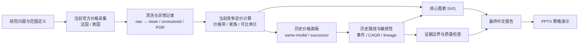

# 奢侈品手袋竞争性定价策略分析

Chanel、Hermès、Louis Vuitton 与 Dior 的法国 / 美国官方本地标价结构与 2020–2026 历史价格路径分析。

## 项目结论

本项目的核心判断是：Chanel 的差异不只是价格更高，而是以较高的可见进入门槛和稳定的 Classic 高位锚点组成一套分层价格架构。当前样本中，较低价格层更多接近 Louis Vuitton 与 Dior，高端价格层与 Hermès 的结构重叠增加；历史选定产品线显示，Chanel 的进入 / 核心组与 Classic 组都上移，绝对价格距离比相对比值更明显地扩大。

报告只讨论公开本地标价样本能支持的外部结构，不推断需求弹性、支付意愿、转化、利润、管理层意图或最优未来价格。

## 方法概览



研究设计、数据血缘、计算定义与局限性见[方法说明](docs/METHODOLOGY_CN.md)。

## 最终交付

- [最终中文报告](FINAL_LUXURY_HANDBAG_PRICING_STRATEGY_CN.md)
- [最终报告附录](FINAL_REPORT_APPENDIX_CN.md)
- [策略演示 PPTX](LUXURY_HANDBAG_PRICING_STRATEGY_PRESENTATION.pptx)
- [核心报告图表](final_report_assets/)

## 可复现入口

```bash
python3 build_competitor_dataset.py
python3 competitive_pricing_calculations.py
python3 build_historical_dataset.py
python3 historical_pricing_calculations.py
python3 build_final_report_assets.py
```

脚本只使用 Python 标准库，默认读取仓库内的采集数据与历史面板，并将计算结果写入 `competitive_pricing_calculations/` 与 `historical_pricing_calculations/`。原始采集记录、清洗数据、来源日志和计算合同均保留在对应目录，便于审计。

## 数据边界

- 当前样本：161 条接受观察，其中 147 条为数值价格。
- 历史面板：77 条接受观察、13 条产品线；其中 7 条同款连续、6 条为后续版本路径。
- 当前结论来自公开官方本地标价的非加权采样，不是全球全量商品普查。
- 法国与美国的本地数值未做 FX、税费、关税和落地成本标准化，因此仅作描述性参考。
- 历史跨品牌相对涨价与 Chanel 向 Hermès 收敛的判断不在本项目可估计范围内。

## 数据使用说明

- 当前价格数据来自品牌官方本地化页面的已接受观察；历史价格资料以公开专业来源为主，来源等级、冲突和未解决项均保留在历史数据目录。
- 本仓库保留页面 URL、观察时间、原始文本/状态与计算输出，供复核与复现；不授予第三方品牌内容、商标或页面素材的再利用权。

## 许可

当前未附带开源许可证。若计划复用代码或数据，请先联系仓库维护者。
